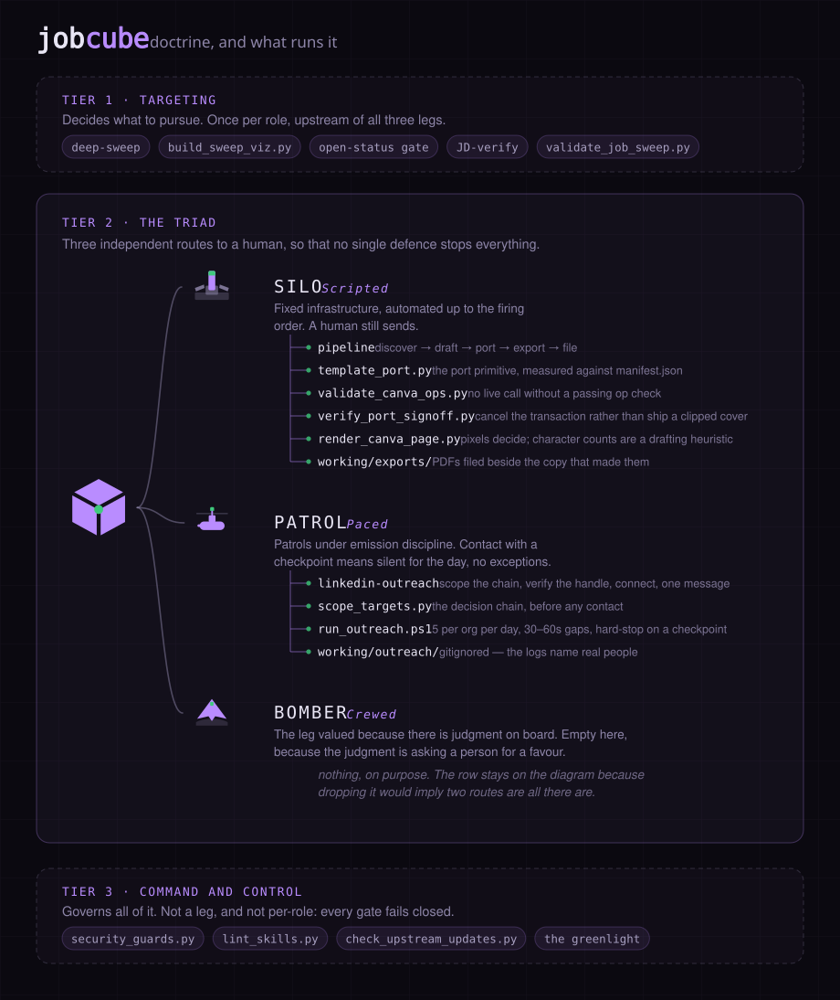

# DOCTRINE.md

The vocabulary this repo uses for its own machinery, and where every capability sits.

Each term below had to pass two tests: it names something the repo **actually does**, with a
file behind it, and it is native to the Cold War deterrence lexicon. A word that passes only
one is decoration, and there is a list of those at the bottom.

A term that is true in both domains stops being atmosphere and becomes
documentation: you can reason about the mechanism from the word.

Three tiers. **Targeting** decides what to pursue. **The
triad** decides how it reaches a person. **Command and control** governs all of it. Tier one
runs once per role rather than once per route, which is why it sits above the legs instead of
inside them.

Every filename in that diagram is generated from
[`assets/build_assets.py`](assets/build_assets.py), so the picture cannot drift from the
tables below without someone editing both.

---

## Tier 1 — Targeting

Upstream of all three legs.

| Term | What it is | Where |
|---|---|---|
| **Overflight** | Searches only the coordinate cells flagged `new=True`. Reconnaissance flies only over territory you lack current film on. | `deep-sweep` skill |
| **The target list** | The one authoritative record of which cells have been searched. Nothing else aims a sweep; if it is not on the list, nothing flies at it. | `working/scripts/viz/build_sweep_viz.py` |
| **Dual phenomenology** | A warning is not an attack until a second independent sensor confirms it. The aggregator is the blip; the live portal is the confirmation. Nothing is drafted before that. | open-status gate |
| **On-site inspection** | Ratings come from the real posting, never the snippet. Arms control's founding finding: declarations are not evidence. | JD-verify |
| **Deconfliction** | An applied or rejected role never resurfaces. One cell, one strike, permanently logged. | `job_scraper/seen_jobs.json`, tracker |
| **Minutes to midnight** | A posting closing within three days is flagged urgent — a published dial whose only job is showing distance to a hard deadline. | sweep doc close-date column |
| **Go/No-Go poll** | A sweep is not presented unless it passes. Every console answers GO, and one NO scrubs the run. | `working/scripts/validate_job_sweep.py` |
| **National technical means** | Verification by your own instruments rather than the other side's declarations — the mechanism arms-control treaties actually ran on. Every posted range a sweep sees is collected, and the band is built from those and nothing else. What an employer says the market pays is a declaration. | `floorprice/collect.py`, `band.py` |

National technical means is the only instrument here read twice: once during targeting, where a
salary floor kills a role before you spend an evening on it, and again after a leg lands, when
the same band is what you argue an offer against. Note the pairing with **on-site inspection**
two rows up — treaties ran on both, and for the same reason. Reading a JD is the inspection;
collecting what employers publish is the sensor that works whether or not anyone lets you in.

---

## Tier 2 — The triad

Three independent routes to a human, so that no single defence stops everything.

### SILO · *scripted*

The employer's own form. Fixed infrastructure, automated up to the firing order; a human
still sends.

| Term | What it is | Where |
|---|---|---|
| **Permissive Action Link** | The warhead is inert without a code stored apart from the weapon. The port primitive refuses to run while the sign-off name is a placeholder, and the config file is where that name lives. | `template/template_port.py`, `template/port_config.json` |
| **Two-man rule** | No launch on one key. You approve, the agent ports, and the validators can still refuse after your key has turned. | the greenlight |
| **Go/No-Go poll** | No live call without a passing op check. | `working/scripts/validate_canva_ops.py` |
| **The fail-safe point** | The line past which there is no recall, so the check happens *at* the line: after the ops apply, before the commit. A failure cancels the transaction rather than committing it. | `utils/verify_port_signoff.py` |
| **Photo interpretation** | No strike was believed until the film came back and someone read it. Character counts are the crew's report; the rendered PNG is the film. | `utils/render_canva_page.py` |
| **The test ban** | A list of things that may never again be detonated in public, amended whenever a new class of blast proves embarrassing. Fails a port outright. | `port_config.json` → `banned_phrases` |

### PATROL · *paced*

Outreach before you apply. Persistent, quiet, surfaces rarely — and you fire every live
command yourself.

| Term | What it is | Where |
|---|---|---|
| **Positive identification** | You do not engage a target you have not positively identified. Never connect to an unverified handle: `profile` must confirm name, title and org first. | `linkedin-outreach` Stage 2 |
| **Emission discipline** | Five connects per organization per day, ten total, randomized 30–60 second gaps. A boat on patrol is quiet because being heard is the whole risk. | `scripts/outreach/run_outreach.ps1` |
| **Dive silent** | A rate limit or security checkpoint hard-stops the day. No retries, no exceptions. | `run_outreach.ps1`, exit 2 |
| **One transmission** | Exactly one message per target after acceptance, then nothing. | `linkedin-outreach` Stage 4 |

### BOMBER · *crewed*

A referral from someone already inside. The leg valued because there is judgment on board.

**There is nothing here, on purpose.** A referral comes from a relationship you either have
or you don't, and tooling that claimed to manufacture one would be the overclaim this
document exists to prevent. The leg stays on the diagram because dropping it would imply two
routes are all there are, and a referral is the one that most often actually works.

---

## Tier 3 — Command and control

Applies to everything above. Not a leg, and not per-role.

| Term | What it is | Where |
|---|---|---|
| **Positive control** | Silence never means go. Absent an authenticated answer, the run turns back — an uncertain check stops rather than proceeding on the balance of probabilities. This is the one doctrine. | every gate |
| **Born classified** | Some categories are classified at creation, regardless of author. `documents/`, `working/outreach/`, any `.env` and generated output are untrackable by category, not by review. | `tools/security_guards.py` |
| **Portal monitoring** | Treaty inspectors sat at the factory gate and itemized everything passing through. This sits at the merge gate and does the same. | `tools/check_upstream_updates.py` |

---

## Outside the tiers

Two capabilities do not fit the three, and forcing them in would be the dishonesty this
document is for. The tiers describe reaching a person. These describe what happens once you
have, which is a different problem and the only part of the process with someone on the other
side of the table.

| Term | What it is | Where |
|---|---|---|
| **Throw weight** | What a delivery system actually puts on target, as against how many launchers you can count. The headline number is not the capability: base salary is the launcher count, and the pension, the leave above statutory and the employer premium are the throw weight. Guaranteed value is reported apart from at-target, because a target bonus is a forecast about someone else's discretion. | `floorprice/offer.py` |
| **War game** | You rehearse an exchange before it happens, against your own best reading of the other side. Assembles the number, the two postings you would cite if pushed, and the prepared answers to the two questions always asked first. It composes and never computes — no number is invented in the rehearsal that was not already in the data. | `floorprice/brief.py` |

The war game refuses below four posted ranges, the same threshold and reasoning as the band
itself: a rehearsal built on two postings teaches you to say a figure you cannot defend, which
is worse than walking in without one. Throw weight needs no observations, because it reads only
the offer in front of you — but it will not estimate a missing term either. An unpriced item is
reported as unpriced and never as zero, and equity is never priced at all.

---

## Terms that need their rationale carried with them

Four of the above overclaim slightly when used bare. Use them with their explanation, or not
at all:

- **The fail-safe point** implies a recall exists. One does, but only before commit. Nothing
  recalls a committed transaction.
- **Dual phenomenology** implies two independent instruments. The second sensor is a human
  reading the live portal — arguably more reliable, but not automated double-confirmation.
- **Deconfliction** implies multiple coordinated shooters. There is one applicant; it is
  really a no-restrike rule against the target list.
- **Portal monitoring** is accurate, but the pun on job portals is a coincidence and should
  not be leaned on.

## Terms considered and cut

The boundary matters as much as the vocabulary.

| Cut | Why |
|---|---|
| Dead Hand | Implies the pipeline can fire without you — the one thing the two-man rule prevents. |
| Launch on warning | Names the exact behaviour the open-status gate bans. Right register, wrong side of the doctrine. |
| SIOP | Implies preplanned strike packages for every contingency. The target list is a coverage record. |
| DEFCON | Implies graded alert states. The urgency flag is binary. |
| Gold codes | Grandiose for a config value. Permissive Action Link takes the slot honestly. |
| Trust but verify | Worn smooth by forty years of quotation, and carries no engineering. |
| Brinkmanship | The pipeline never bluffs. Every threat it makes, it executes. |
| Fallout | Nothing here models consequence. Too grim to spend on nothing. |
| Countdown hold | Cape Canaveral vocabulary. Space programme, not deterrence. |
| Circular error probable | Was proposed for the cover-gap tolerance. CEP is accuracy across many shots; that check is a single-shot tolerance. Dressing one as the other is the failure this vocabulary prevents. |
| Underground testing | Was proposed for local-first. It implies nothing escapes at all, while applications and outreach leave by design. Local-first still has no honest term. |

## Adding a term

Two tests, both required. If a capability has no honest counterpart, it does not get one —
an unnamed mechanism is better than a mechanism wearing a word that promises more than it
does. That is why the bomber section has no table and local-first has no term.
