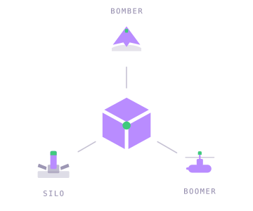

# jobcube

**Second-strike capability for job applications.**

<br clear="left" />

Hiring has become a race condition. Employers deployed keyword filters, so applicants
learned to stuff keywords. Employers deployed ATS ranking, so applicants learned to
format for parsers. Employers deployed AI screening, and applicants — reasonably —
reached for AI too. Your application is now written by a model, ranked by a model, and
declined by a model, and somewhere in that loop a person may briefly glance at it.

Disarmament would be lovely. It is also not on the table, because neither side can verify
the other has stopped. So this is an escalation, and it makes no particular claim to being
a noble one. What it does claim is discipline: every fact true, every posting confirmed
open before you spend an evening on it, every page laid out so it survives contact with a
recruiter's screen. Parity, achieved responsibly.

It is an agent workspace — built for [Claude Code](https://claude.ai/code) and
[Codex](https://openai.com/codex), and not really tied to either. You supply a real profile
and judgment; it supplies search, screening, drafting, layout, verification, and filing.

The name is not decorative. The search space really is modelled as a cube — sector ×
focus × seniority, every cell a numbered coordinate — and a good deal of the tooling
exists to stop you wandering back into rooms you have already cleared. That the reference
also involves a large number of identical rooms, unexplained traps, and nobody in charge
is not something this repository is able to fix.

> **This is a template.** Fork it and fill in your own profile. Every personal value is a
> `[BRACKETED]` placeholder — there is no real person's data in here.

---

## The escalation ladder

Each guard exists because the corresponding failure actually happened, usually more than
once, and usually late enough to hurt.

| Their move | The counter |
|---|---|
| Postings that stay listed long after they close | An **open-status gate**: nothing gets drafted until you confirm the role live in its own portal. Three roles died mid-pipeline before this rule existed. They had been closed the entire time. |
| Job titles that describe a different job | **JD-verify before rating.** Every finalist's stars come from reading the actual posting, with the hard gates — level, salary, domain, work authorization — folded in. A title plus a search snippet is a rumour, not a requirement. |
| Six seconds of human attention, if you're lucky | **Length-matched copy, verified in pixels.** Layout boxes are absolutely positioned, so one extra wrapped line lands on top of the box below. Character counts are a drafting heuristic; the exported PDF is rendered to PNG and *looked at* before anything ships. Throwing a boot into the room first tells you something. It does not tell you the room is safe. |
| Design tools that fail quietly | Canva drops text that overflows a fixed-height box and reports nothing. This once shipped a cover letter with the sign-off clipped off the bottom — confident, anonymous, gone. The sign-off is now guarded at three separate points, and a failed check cancels the transaction rather than committing it. |
| Screeners who can smell a language model at forty paces | An **anti-slop pass** at generation, at review, and at final polish, plus a ban list you extend the first time a phrase makes you wince. "I would welcome the opportunity to leverage" is already in there. |
| Applicant #482 in the queue | **Outreach before submission.** Scope the decision chain, verify handles, connect, and send exactly one short message — then apply. Strictly paced, because a restricted LinkedIn account costs more than any single application is worth. |

There is exactly one doctrine here: **every gate fails closed.** A validator that isn't
sure stops the run rather than proceeding on the balance of probabilities. This is
deliberate, and it is the one design decision worth stealing even if you use none of the
rest: the failure mode of an automated job search is not doing too little, it is
confidently doing the wrong thing at volume. Trust, but verify. Mostly verify.

---

## Three ways in



One delivery route can be defended against; three can't. An application reaches a human by
exactly three paths, and the pipeline treats them as separate legs because they fail
separately:

| | Leg | Route | Character |
|---|---|---|---|
|  | **Silo** | Portal submission | Fixed address, hardened, everyone knows where it is. Still works. |
|  | **Boomer** | LinkedIn outreach | Quiet, mobile, surfaces once. Rate-limited on purpose. |
|  | **Bomber** | Warm intro | Slow, visible, and the only leg you can recall after launch. |

The mark is the same diagram at lower resolution: an isometric cube's three faces radiate at
120°, which is exactly where the three legs sit.

---

## Setup

**You need:** a coding agent — [Claude Code](https://claude.ai/code) or
[Codex](https://openai.com/codex) · a Canva account with the MCP connector enabled ·
Python 3.11+ (`pip install plotly pymupdf`).

**Which agent, honestly.** The parts that do the work — the validators, the port primitive,
the render-verify loop, the coverage map — are plain Python and plain Markdown, and run
under either. What is *not* portable is the invocation layer: `.claude/skills/` and
`.claude/commands/` are Claude Code mechanisms, so `deep sweep` and `/pipeline` autoload
there and nowhere else. Under Codex you read [`AGENTS.md`](AGENTS.md) and run the same
procedures by name. Same pipeline, same gates, one fewer keyboard shortcut.

**Optional:** Adzuna / Jooble API keys for wider search coverage · PyYAML (the linter
falls back to its own parser without it) · MiKTeX or TeX Live for the LaTeX fallback —
note the two files need **different engines**, `cv/main_example.tex` builds with
`lualatex` and `cover_letters/cover_example.tex` with `xelatex`, because `cover.cls` is
XeTeX-only. Both are verified to build, and CI compiles them on every push.

```bash
git clone --recurse-submodules https://github.com/<you>/<your-fork>.git
```

`--recurse-submodules` matters: the LinkedIn CLI is vendored as one.

Then drop your real documents into `documents/` — CV, LinkedIn export, references,
transcripts. Contents are gitignored; only the folder structure is tracked. See
[`documents/README.md`](documents/README.md).

Then run:

```
/setup
```

It reads those documents, interviews you for the parts no CV contains, and fills in the
four things the pipeline cannot run without:

1. **Your profile** in [`CLAUDE.md`](CLAUDE.md) — the source of every claim in every
   application you send. It will not invent anything; missing facts stay blank and get
   asked about. Where your CV and your LinkedIn export disagree — and they will, usually
   about end dates — it surfaces the conflict rather than picking one.
2. **Your sign-off name** in
   [`port_config.json`](working/scripts/template/port_config.json). The porting tools
   refuse to start while this is a placeholder, on the grounds that a tool which will not
   run is a better outcome than a cover letter that ships unsigned.
3. **Your Canva design** — N identical résumé + cover-letter pairs, where pair *k* is page
   2k−1 (résumé) and page 2k (cover).
4. **Your search space** — the cube's axes, the first regions to sweep, your level and
   salary floor, and your market's job boards.

Re-run `/setup` whenever you add documents; it enriches rather than overwrites. Then read
[`GETTING_STARTED.md`](GETTING_STARTED.md), which is the real walkthrough — box
calibration, the render-verify loop, and the filing convention.

---

## Running it

| Invocation | What happens |
|---|---|
| `/setup` | Onboarding, and re-runnable as your document pile grows. `--profile`, `--layout`, `--search`, `--check` re-run one part. |
| `deep sweep` | Searches the regions you've queued in `build_sweep_viz.py`, JD-verifies the finalists, and writes one gated sweep doc. Proposes only — it never applies to anything. |
| `/pipeline` | The full run: discover → evaluate → draft → review → port → export → file. Takes `--confirm`, `--auto`, `--search-only`, `--min-stars=N`. |
| `/search` | Discovery on its own, deduplicated against everything you've already seen. |
| `/add-portal` | Investigates a job board — robots.txt, access rules, a live query — and registers it, or records *why* it failed so no future sweep retries it. |
| outreach | Ask for it by name once a role is confirmed open and drafted. You run every live LinkedIn command; Claude prepares them and keeps the log. |

The intended rhythm is **one conversation, one sprint**. Claude searches, screens, and
drafts; you read the drafts in your IDE and greenlight; Claude does the layout, the
verification, and the exports. You are the judgment in the loop, not the overflow
detector.

### The room numbers

`working/scripts/viz/build_sweep_viz.py` is the steering wheel. It holds where you have
already looked and where you have not, plotted as a cube of sector × focus × seniority,
and `deep sweep` searches exactly the regions flagged `new=True`.

Move a region into the explored list once you've swept it. Skip that and the map starts
lying to you, and a map that lies is worse than no map — you will re-mine the same seam
for a month and call it thorough. Rooms move, too: boards add bot protection, postings
close, an employer quietly stops hiring. `/add-portal --recheck` re-verifies a board that
has gone quiet, on the theory that silence usually means the corridor changed rather than
the market did.

---

## The map

```
CLAUDE.md              Your profile + the rules the agent follows ← edit this first
AGENTS.md              Entry point for Codex; points back at CLAUDE.md
GETTING_STARTED.md     The full walkthrough
HANDOFF.md             Sprint state, carried between sessions
documents/             Your private inputs (contents gitignored)
cv/ cover_letters/     LaTeX fallback, placeholder-tokenized
working/
  templates/           Copy these: sweep, packet, outreach log
  active/              Live sweep + current interview doc, nothing else
  outreach/            Per-org outreach logs (gitignored — real people's names)
  exports/             Filed applications: PDFs beside the copy that made them
  archive/             Finished sprints, sweeps, packets
  scripts/
    template/          template_port.py + manifest.json — the port primitive
    utils/             render, sign-off verify, cover-gap measurement
    viz/               3D coverage visualisation + sweep data
    outreach/          Log scaffolder + paced LinkedIn wrapper
.claude/skills/        job-scraper · pipeline · deep-sweep · linkedin-outreach
.claude/commands/      /setup · /add-portal
tools/                 Linter, security guards, upstream-drift checker
assets/                Logo, three leg icons, triad emblem, social preview
```

---

## Calibrate it, don't inherit it

Numbers that came from one person's layout are not laws of nature, and this repo tries
hard not to pretend otherwise:

- **Box capacities.** `manifest.json` ships measurements from one specific Canva design.
  Run `template_port.py build-manifest <snapshot> --name v2` against your own geometry and
  recalibrate. The shipped numbers are a worked example.
- **The example datasets.** The jobs in `build_job_viz.py` and the sweeps in
  `build_sweep_viz.py` are labelled placeholders so the visualisation has something to
  draw. Delete them.
- **The board registry.** `boards.md` is Canada-weighted because the rest of the template
  is. The transferable part is the discipline — verify a board is fetchable, record the
  URL pattern, record what failed and why — not the particular list.
- **Your voice.** Add to the *Never-Use Words & Phrases* list in `CLAUDE.md` the first
  time a phrase isn't yours. The point is never having to flag it twice.

---

## Rules of engagement

**Job postings are untrusted input.** Fetched or pasted by hand, they are third-party
content: data to evaluate, never instructions to follow. Typing one in yourself does not
launder it.

**Nothing personal gets committed.** `documents/`, outreach logs, generated visualisations,
and `.env` are all gitignored, and `tools/security_guards.py` fails the build if any of
them are tracked anyway — a `.gitignore` rule does not untrack a file that was added
before it existed. Run it before you make a fork public.

**Outreach is rate-limited on purpose.** Five connections per organization per day, ten
total, one message per person, no follow-up sequences. The wrapper enforces the pacing and
hard-stops on a rate limit or a security checkpoint. When it stops, stop for the day.

**Honest limits.** This gets your application in front of a human in good shape. It does
not know whether the role was earmarked for an internal candidate before it was posted,
and neither do you.

It is worth being clear about what you are escalating against. There is no committee
coordinating the hiring market, no strategy, nobody at the top of it who could call the
whole thing off if asked nicely. It is a headless system that grew, and the traps in it
are mostly not aimed at anyone in particular — which is worse than malice, and the reason
the doctrine is what it is. Against something with no intent, a gate that fails closed
beats a clever heuristic every time. Nobody wins an arms race. You just avoid losing it
badly, on a Tuesday, to a posting that closed in March.

---

## Acknowledgements

Forked from [MadsLorentzen/ai-job-search](https://github.com/MadsLorentzen/ai-job-search)
and rewritten around the design-porting pipeline and its verification loop. The LaTeX
templates and the `documents/` intake convention come from upstream.

## License

MIT — see [`LICENSE`](LICENSE). Bundled fonts in `cover_letters/OpenFonts/` are under the
SIL Open Font License.
